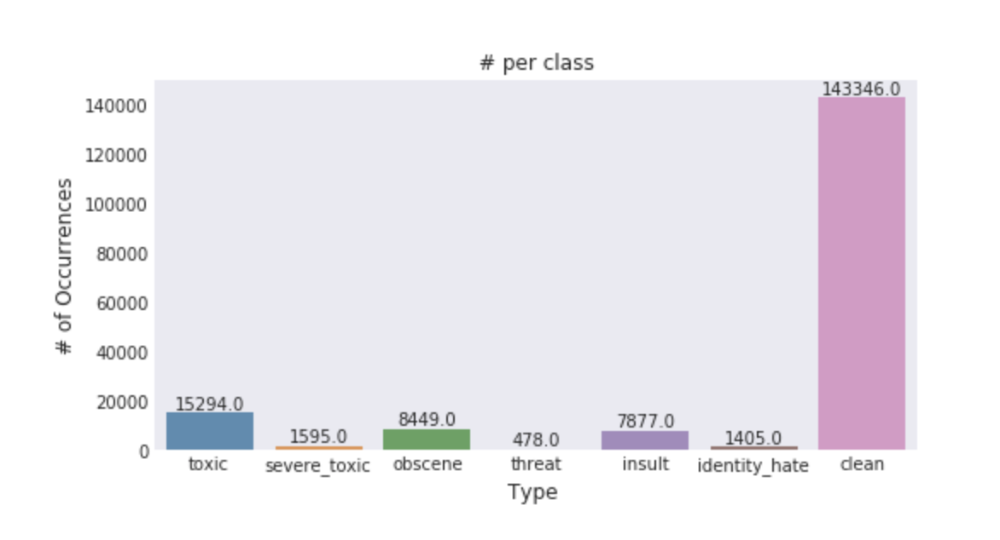

# Machine Learning Engineer Nanodegree

## Capstone Proposal

Joe HUANG 

November 15th, 2018

## Proposal

项目名称: Toxic Comment Classification（恶毒评论分类）

### Domain Background

随着互联网与社交媒体的发展，恶毒评论在各大论坛网站层出不穷，如虎扑、Facebook等。对恶毒评论研究分类，可以有效的清理网络环境，这里用到的主要技术是自然语言处理。

自然语言处理方向（简称NLP），是机器学习中十分热门的一个方向。据维基百科所述，NLP是计算机科学、信息工程和人工只能的重要领域，是计算机与人类语言交互的重要手段，它通常包括认知、理解和生成等部分。其中认知和理解是电脑将输入的语言变成特定的符号，生成则是将计算机数据转化成自然语言。

同其他机器学习领域类似，自然语言的起源也很早，早在上世纪50年代就被伟大计算机科学界艾伦-麦席森-图灵所提及，但却局限于当时的计算水平而无法真正意义上的普及。著名的“图灵测试”就是当时被提出，这是一项判断机器语言与自然语言的标准。2018年google IO大会上推出的google assistant，迄今最有可能通过该测试。

自然语言的处理范畴很多，包括文本朗读（Text to speech）/语音合成（Speech synthesis），语言识别（Speech recognition），语法分析（Parsing）、自然语言生成（Natural language generation）和文本分类（Text categorization）等等。较大众所熟知的多为语言识别类，而本毕业项目“恶毒评论分类”则属于文本分类范畴。

### Problem Statement

恶毒评论项目源于Jigsaw(前身为Google ideas）在kaggle平台上举办的一场文本分类比赛[1]，旨在对于网络社区部分恶毒评论进行区分鉴别。文本分类是自然语言中比较普遍的应用，如文件邮件自动分类等，目前主要有传统机器学习和深度学习模型方法等。常见的处理流程包括：训练样本预处理、特征选择、计算特征权重得到文本向量和模型训练与预测。

主要思路设计模型以区分语句类型，包括toxic、obscence等，详见下一节，项目的重点难点在于合适的文本向量与合适的训练预测算法。

### Datasets and Inputs

kaggle中提供的数据包括4部分：train，test，sample_submission，test_lables。

train训练数据总量约160k，包含1个id行和7个标签数据，见下图。数据的分布为非均匀分布，并且每个数据可能对应多个标签，其中clean语句的分布最多，约为87%。toxic语句约为9.5%，obscence语句约为5.3%，insult语句约为4.9%，severe-toxic语句约为1%，identity_hate语句约为0.88%，treat语句最少，约为0.3%。

test和test_lable为测试数据及标签，总量约为150k。test数据只包含id，comment_text，output需要输出分类概率。

train数据分布图

### Solution Statement

主要解决思路是根据comment，运用合适的算法，得到语句对应7种标签的概率，类似如下：

| id                  | toxic | severe_toxic | obscene | threat | insult | identity_hate |
| --------------- | --------| ------------------| ------------ | --------- | -------- | ------------------- |
| 00001cee341fdb12 | 0.5   | 0.5          | 0.5     | 0.5    | 0.5    | 0.5           |

词向量与训练将采用word2vec形式，算法主要采用CNN形式进行特征提取，得出相应ROC-AUC值，最终生成submission概率文件，提交至kaggle。

### Benchmark Model

自然语言算法模型分类大致分为传统方法和深度学习神经网络方法。传统方法主要是从原始文档提取特征，在制定分类器进行计算。经典特征提取方法如频次法、tf-idf、互信息法、Ngram，分类器算法如LR、SVM等。神经网络特征提取方法如CNN、RNN、LSTM等。基于传统方法tf-idf和LR算法已经可以很好地得到分类结果[6]，本项目将其作为benchmark model。

### Evaluation Metrics

根据kaggle上的描述，采用ROC AUC评估矩阵方式，分数计算方式为每一个预测列的平均AUC值。

ROC曲线为True Positive Rate和False Positive Rate曲线图[8]。ROC曲线特性适用于当测试正负样本集变换时，ROC曲线能保持不变。对于实际数据中出现样本分类不平衡时，集正负样本比例比较大且随时间变化时，ROC曲线基本保持不变。AUC（Area Under Curve），即ROC曲线下方面积，介于0.1-1。AUC值越趋向1，分类器效果越好。

### Project Design

项目设计步骤主要有以下几步：

- 数据挖掘分析

- 数据处理

- 算法模型设计

- 算法模型评估

**数据挖掘分析**

数据挖掘分析，主要是采取可视化的方式对训练测试数据进行展示，如数据量大小、toxic comments与non-toxic comments的分布等。可以借助大数据词云显示等，分别展示toxic comments与non-toxic comments的较大词频词语的分布等，有助于本人了解不同分类语句之间的主要区别，也有助于下一步数据处理。

**数据处理**

数据处理是主要包括数据预处理与主处理。

数据预处理主要是对数据进行清洗，去除一些训练测试数据中出现的空白、乱码词句、杂乱无章等非正常语句。

数据主处理主要是对语句进行处理，计算机无法识别自然语言，必须将其转换成机器语言。本项目中，需要将语句解析分成单独词字，再将词字转化成数值形式，并进行编码。这种形式称为word embedding[4]，常见手段有Glove、fastText、word2vec。杜热编码（One-Hot encoding）也是一种方式，但对任意词的余弦相似度都为0，但无法表达不同词之间的相似度。

对于自然语言处理而言，预训练词向量特别关键。本项目将采用word2vec方式[3]。

**算法模型设计**

算法主要采用CNN进行特征提取，CNN的优势在于能快速进行计算，在表征方面也更加有效[5]。在NLP自然语言文本分类，对于本项目包含情感的分类比较有效。本项目将主要给予keras上的模型。

**算法模型评**

在算法训练完成后，需要对算法模型进行评估。应用算法对测试数据进行预测，并根据上文提及的ROC-AUC评估矩阵，对预测值进行评估。

### Reference

[1]. https://www.kaggle.com/c/jigsaw-toxic-comment-classification-challenge#description

[2]. https://blog.csdn.net/Heloiselt/article/details/80870794

[3]. XinRong, word2vec Parameter Learning Explained, 2016.

[4]. http://wiki.jikexueyuan.com/project/deep-learning/word-vector.html

[5]. https://jizhi.im/blog/post/understanding-convolutional-neural-networks-for-nlp

[6]. https://www.kaggle.com/tunguz/logistic-regression-with-words-and-char-n-grams

[7]. https://www.kaggle.com/yekenot/textcnn-2d-convolution

[8]. https://en.wikipedia.org/wiki/Receiver_operating_characteristic

